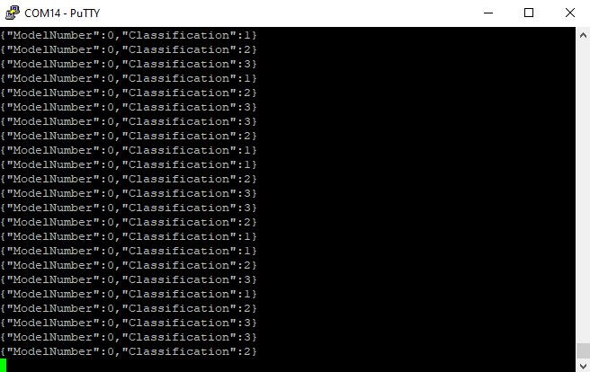

# Template MPLAB X Project for SensiML

# Contents
* [Overview](#overview)
* [Knowledge Pack Deployment](#knowledge-pack-deployment)
* [Knowledge Pack Integration](#knowledge-pack-integration)
  * [Binary Format](#binary-format)
  * [Library Format](#library-format)
  * [Source Format](#source-format)
* [Firmware Operation](#firmware-operation)
* [Visualization with SensiML Open Gateway](#visualization-with-sensiml-open-gateway)

# Overview
This repository contains an MPLAB X project that can be used as a starting point for running any SensiML Knowledge Pack on the [PIC-IoT Development Board](https://www.microchip.com/en-us/development-tool/AC164164) with the [MIKROE 6DOF IMU2 Click Board](https://www.mikroe.com/6dof-imu-2-click). Read on for instructions on how to go from a SensiML Knowledge Pack deployment to a full working MPLAB X project.

## Hardware Used
* [PIC-IoT Development Board](https://www.microchip.com/en-us/development-tool/AC164164)
* [MIKROE 6DOF IMU2 Click Board](https://www.mikroe.com/6dof-imu-2-click)

## Software Used
* [MPLAB® X IDE](https://microchip.com/mplab/mplab-x-ide)
* [MPLAB® XC16 compiler](https://microchip.com/mplab/compilers)
* [MPLAB® Code Configurator (Classic)](https://www.microchip.com/en-us/tools-resources/configure/mplab-code-configurator/classic)
* [SensiML Analytics Toolkit](https://sensiml.com/download/)

## Related Documentation
* [PIC24FJ128GA705 Product Family Page](https://www.microchip.com/en-us/product/PIC24FJ128GA705)
* [PIC-IoT WG Development Board Product Page](https://www.microchip.com/en-us/development-tool/AC164164)

# Knowledge Pack Deployment
To deploy a knowledge pack for the PIC-IoT Development Kit:

1. Open up your SensiML project in the [Analytics Studio](https://app.sensiml.cloud/) and navigate to the *Download Model* tab.
2. Select `Microchip PIC-IoT Development Board` from the *HW Platform* options.
3. Select one of *Binary*, *Library* or *Source* from the *Format* options. *Note: source format is only available for upper tier customers*.
4. Select the appropriate sensor configuration for your project from the *Data Source* options. Note that this configuration should match the one you used to capture the data your model was trained with.
5. Click the *Download* button to download the model.

# Knowledge Pack Integration

## Library Format
If you deployed a knowledge pack in the *Library* format, the archive should contain a complete, ready to compile, MPLAB X project. Follow the steps below to compile your project:

1. In MPLAB X, open up the .X project folder under the `firmware` folder of the knowledge pack
2. Ensure that the new knowledge pack has replaced the one supplied in this archive.

Your project should now be ready to compile.

## Source Format
If you deployed a knowledge pack in the *Source* format there are a few manual steps to add the required sensiml files to the MPLAB X project:

1. In MPLAB X, open up the .X project folder under the `firmware` folder of this repository.
2. In the *Projects* pane, right click the *Header Files* folder under the template project and select *Add Existing Items from Folders* from the options.
3. In the resulting window that opens, click the *Add Folder* button.
4. In the new dialog, select *Header Files* from the *Files of Type* dropdown, then navigate to the template project's `firmware` directory and select the `knowledgepack` directory. Click the *Select* button to add the directory.
5. Back in the *Add Files* window, click the *Add* button to finish adding the necessary header files and close the dialog.
6. Right click the *Source Files* folder in the *Projects* pane and select *Add Existing Items from Folders* from the menu. Repeat steps 4-6 to add all source files (.c files) from the `knowledgepack` folder.

Your Knowledge Pack is now integrated into your MPLAB X project. You should be able to compile your project and flash it onto the PIC-IoT Development Board.

# Firmware Operation
The firmware behavior can be summarized as operating in one of three distinct states as reflected by the onboard LEDs and described in the table below:

| State |	LED Behavior |	Description |
| --- | --- | --- |
| Error |	Red (ERROR) LED lit |	Fatal error. (Do you have the correct sensor plugged in?). |
| Buffer Overflow |	Yellow (DATA) and Red (ERROR) LED lit for 5 seconds	| Processing is not able to keep up with real-time; data buffer has been reset. |
| Running | Yellow (DATA) LED flashing slowly |	Firmware is running normally. |

When operating normally, the firmware prints the classification prediction (classification ID number) and the generated feature vector for each sample window over the UART port. To read the UART port use a terminal emulator of your choice (e.g., MPLAB Data Visualizer's integrated terminal tool) with the following settings:

- Baudrate 115200
- Data bits 8
- Stop bits 1
- Parity None

A sample of the terminal output is shown in the figure below.  Note the knowledge pack used for this example produces a test pattern 1,2,3,3,2,1...

|  |
| :--: |
| UART Terminal Output |

Note that by default the feature vector will not be output. You can enable this behavior by setting `write_features=1` in `sml_output.c`.

# Visualization with SensiML Open Gateway
In addition to reading the text output of the firmware with a terminal emulator, the output may be visualized with the SensiML [Open Gateway application](https://github.com/sensiml/open-gateway). Follow the below instructions to get started:

1. Open a terminal and change to the directory where you've checked out this repository.
1. Clone the open-gateway repository and install the dependencies:
    > `git clone https://github.com/sensiml/open-gateway`\
    > `pip install -r open-gateway/requirements.txt`
2. Change the baudrate (`BAUD_RATE` variable) in `open-gateway/config.py` to 115200
3. Change to the open-gateway directory and run the open-gateway application, passing in the knowledge pack model.json description file:
   > `cd open-gateway`\
   > `python app.py -m $(find ../firmware/knowledgepack/ -name model.json)`
4. Connect to the PIC-IoT Development Kit in the gateway application:
   * Select the `Recognition` device mode.
   * Select `Serial` connection type, and enter the UART address (e.g. COM4) in the `Device ID` field.
   * Click `Connect To Device`.
6. Switch to the `Test Mode` tab and click `Start Stream`.